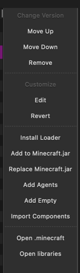

# nebula-1.7.2 forge edition

i finally did it...

---

## Installing w/ Prism Launcher

Create a new Forge 1.7.2 instance, as you will need to modify it.

Once you create the instance, click `Edit`. Then in the new window, press `Version` and then click on the `Forge` item in the list.

Press `Customize` and then `Edit` on the right sidebar



Once you press `Edit`, it will open a text editor. Copy-paste the bottom JSON into that file and save your changes.

```json
{
  "+tweakers": [
    "cpw.mods.fml.common.launcher.FMLTweaker"
  ],
  "formatVersion": 1,
  "libraries": [
    {
      "name": "net.minecraftforge:forge:1.7.2-10.12.2.1161-mc172:universal",
      "url": "https://maven.minecraftforge.net/"
    },
    {
      "name": "net.minecraft:launchwrapper:1.9"
    },
    {
      "name": "org.ow2.asm:asm-all:5.2",
      "url": "https://repo1.maven.org/maven2/"
    },
    {
      "name": "org.scala-lang:scala-library:2.10.2",
      "url": "https://maven.minecraftforge.net/"
    },
    {
      "name": "org.scala-lang:scala-compiler:2.10.2",
      "url": "https://maven.minecraftforge.net/"
    },
    {
      "name": "lzma:lzma:0.0.1"
    }
  ],
  "mainClass": "net.minecraft.launchwrapper.Launch",
  "name": "Forge",
  "releaseTime": "2014-07-02T17:56:52-04:00",
  "requires": [
    {
      "equals": "1.7.2",
      "uid": "net.minecraft"
    }
  ],
  "uid": "net.minecraftforge",
  "version": "10.12.2.1161"
}
```

Once you do that, you are now able to drag & drop the nebula forge jar into your mods folder!

An easier way (such as an installer) will be included in the actual forge mod JAR later.

Note: Prism should automatically use Java 8, if it does not you will need to force Prism to use Java 8.

---